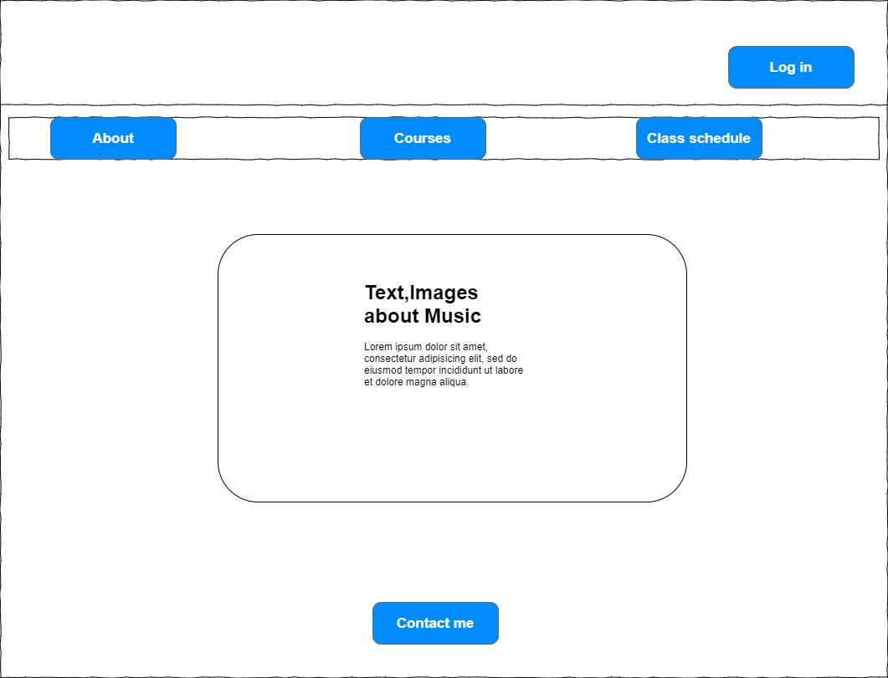
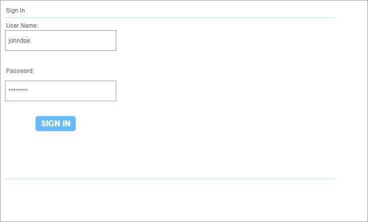
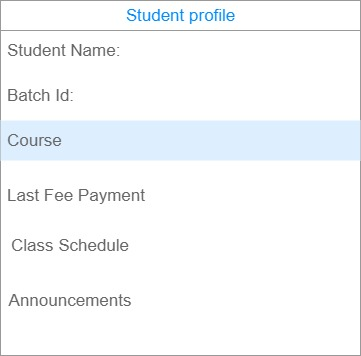
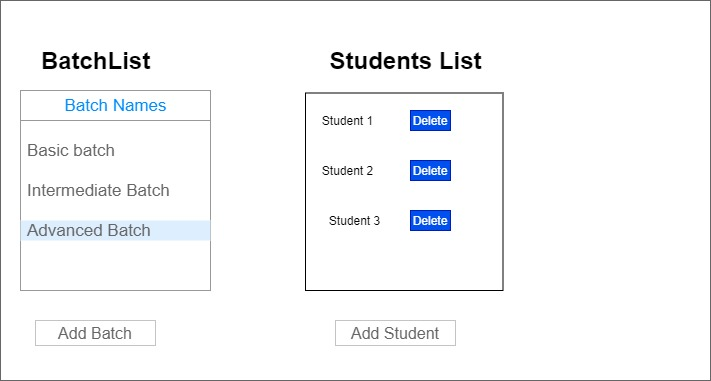
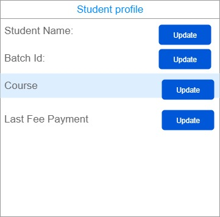
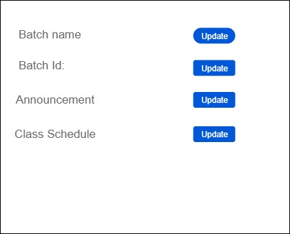

# Project Planning
For this assignment, you'll create some initial plans for your project.

## Assignment Description
[Project Planning Assignment](https://education.launchcode.org/liftoff/modules/assignments/project-planning)

## Submission Instructions

### Wireframes
* Home page 
* Log in 
* Regular user home page 
* Admin home page 
* Admin student detail 
* Admin batch detail 

### Project Tracker

https://trello.com/b/f9KiquBO/agile-sprint-board#

### Project Repo Link

https://github.com/ammumeenas/studentdatabase-mabagement-system
